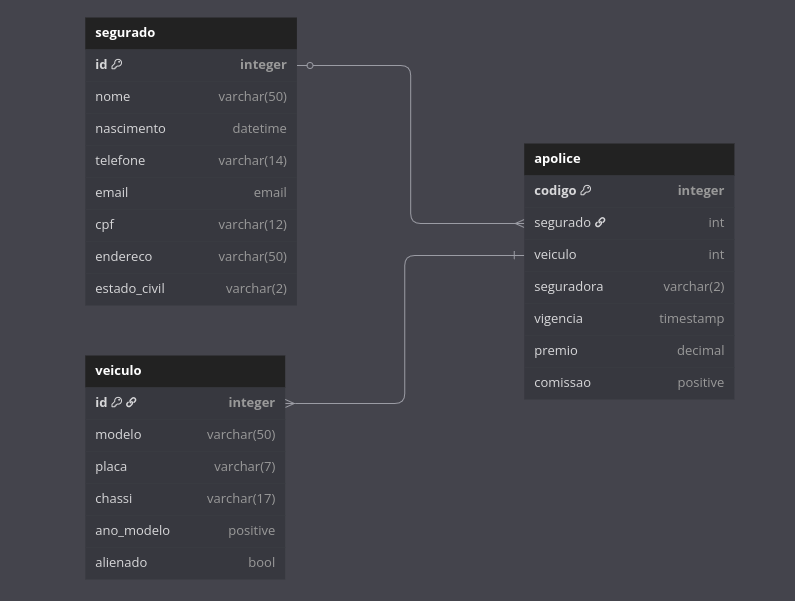

# 🛡️ Client Management System for Insurance Brokerage

This is a web-based system developed to automate the management of clients, vehicles, insurance policies, and commissions within an insurance brokerage. It replaces physical paperwork and spreadsheets with a centralized and user-friendly platform, making it easier to search, register, and monitor key business data.

---

## 🚀 Key Features

- 🧾 **Client Registration**  
  Interface to create, edit, and list clients with personal and contact information.

- 🚗 **Vehicle Management**  
  Register vehicles linked to clients, with insurance-related data.

- 📄 **Policy Management**  
  Assign insurance policies to clients and vehicles, including expiration dates, insurance company, and coverage types.

- 🔍 **Search and Filtering**  
  Search system for policies by number, client name, license plate, and other criteria.

- 💰 **Commission Tracking**  
  View commissions per policy, expiration dates, and monthly earnings.

---

## 🧰 Technologies Used

- **Backend:** Python, Django
- **Frontend:** HTML, CSS, Bootstrap, JavaScript
- **Database:** PostgreSQL
- **Others:** Django Admin, Django Templates, Django ORM

---

## 🖼️ Imagens e Demonstração

<!--- ### 📸 Interface de Cadastro

### 📸 Tela de Busca por Apólices
 --->

### 🗃️ Diagrama do Banco de Dados

